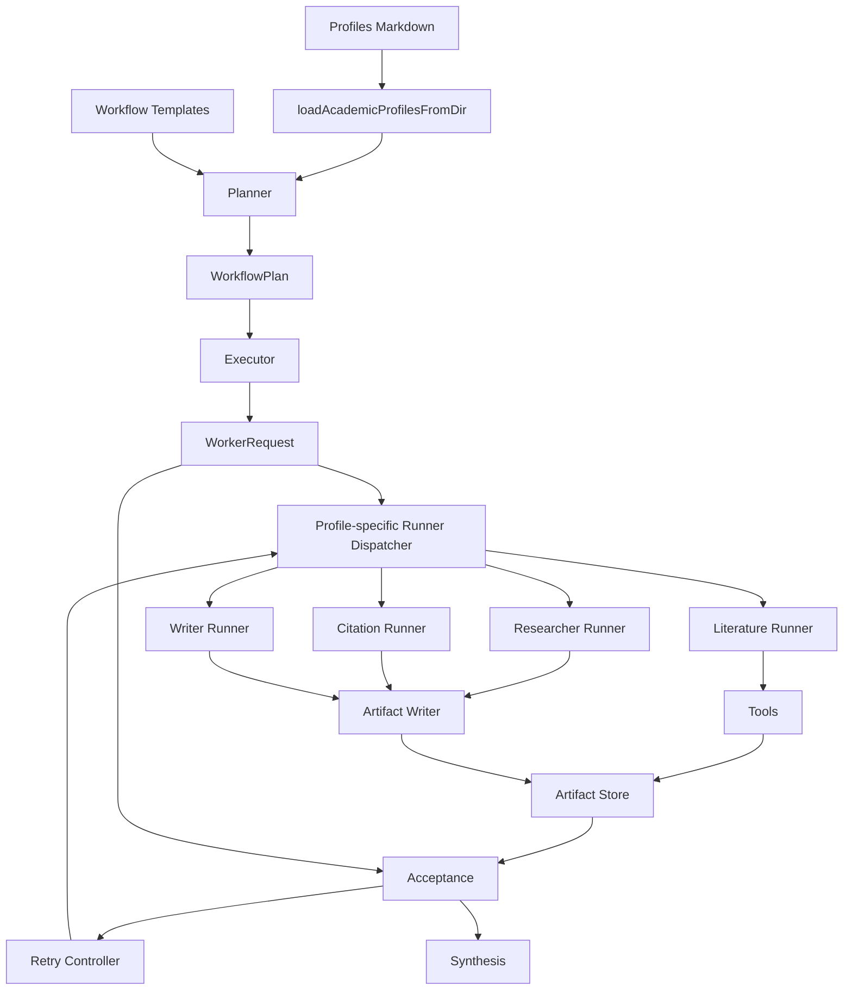
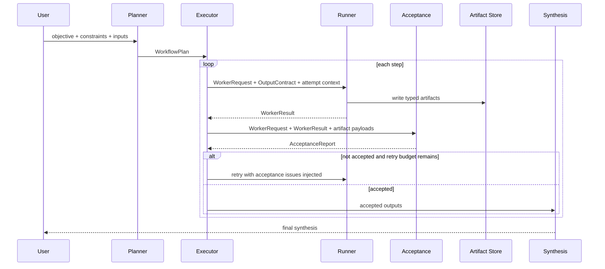

# academic-agent main 分支 contract-first 重构实施报告

## 执行摘要

我对 `academic-agent` 仓库的 **main 分支**做了逐文件核查，覆盖了 `packages/agent-contracts`、`packages/lead-agent/src/orchestration/*`、`packages/lead-agent/src/workers/*`、`packages/lead-agent/src/literature/*`、`packages/artifact-core`、`profiles/*.md`、`academic-smoke` 入口、根目录脚本、`package.json`、`tsconfig.json` 与测试目录。需要先澄清一件事：你现在频繁看到的 `worker_failed`、`expected_output_missing`、`worker_warning`，严格说并不是“JSON Schema 解析失败”，而是 **acceptance/contract 层**在 `WorkerResult` 产生之后给出的验收问题。`createAcceptanceReport()` 只在 `status === "success"` 且没有 error 级 issue 时判 accepted，而 `acceptance.ts` 会把 worker status、`expectedOutputs` 是否命中、warnings/open questions 一并转成 issues。citeturn12view0turn22view4turn14view0turn21view0

我的结论很明确：**主因不是 prompt 单点失效，而是 contract、runner、acceptance、retry、planner validator、artifact writer 之间存在系统性断裂**。prompt 设计确实偏弱，但它更像是放大器；真正导致你反复撞到 schema/acceptance 问题的，是上游用字符串描述输出、下游用字符串猜测是否满足、默认 runner 又只会把 `literature.search` 的 artifact 当成成功信号，导致大部分非 literature profile 在默认路径上天然失败。citeturn23view0turn22view0turn14view0turn49view1turn49view2turn18view3

从 main 分支代码路径推断，当前系统在“学术多 worker 工作流”层面实际上只真正打通了 **结构化 planner** 和 **literature search tool**，但没有把“结构化输出契约”贯穿到 planner、executor、runner、artifact-store、acceptance。最典型的例子是：`WorkflowStep` 里有 `expectedArtifactKinds`，但 `WorkerRequest` 没有这个字段，`workerRequestForStep()` 不传，`acceptance.ts` 也不检查，这个契约从 plan 到执行阶段事实上已经失活。citeturn23view0turn22view0turn44view1turn14view0

因此，我建议的长期重构方向不是继续补 prompt，而是把现有 `string[] expectedOutputs / acceptanceCriteria` 体系替换成 **contract-first 的 `OutputRequirement / ExpectedWorkerOutput / Artifact schema` 体系**，并同步拆分 profile-specific runner、补齐 planner validator 的 profile-output compatibility 校验、把 acceptance issues 注入 retry prompt、引入 typed artifact writer，最后再把 abort signal 与 smoke/live contract tests 打通。这样做才能从根本消除“worker 经常过不了验收/契约”的整类问题。citeturn10view0turn16view0turn44view0turn49view1turn49view2turn24view0turn25view0

## 代码库范围与证据地图

下表是我按你要求核查的核心范围，以及 main 分支对应的实际状态。对于仓库中未出现的目标路径，我明确标注为“未指定”或“路径不存在”。citeturn12view0turn21view0turn20view0turn11view5turn39view0turn45view0

| 模块或路径 | main 分支状态 | 关键观察 |
|---|---|---|
| `packages/agent-contracts/src/index.ts` | 存在 | `WorkerRequest`、`WorkflowStep` 仍以 `expectedOutputs: string[]`、`acceptanceCriteria: string[]` 为主，`WorkflowStep` 有 `expectedArtifactKinds`，但该字段未贯穿到执行与验收。citeturn22view0turn23view0turn23view2turn44view1turn14view0 |
| `packages/lead-agent/src/orchestration/planner.ts` | 存在 | validator 主要校验结构、profileId、objective 格式与输入 artifact refs；**不校验 profile 与 step 输出契约兼容性**。citeturn8view0turn8view1turn8view2 |
| `packages/lead-agent/src/orchestration/llm-planner.ts` | 存在 | planner prompt 看到的是字符串化 expected outputs 与“被裁剪过的模板摘要”，模板里的 artifact/output 契约信息在摘要阶段被丢弃。citeturn10view0turn16view0 |
| `packages/lead-agent/src/orchestration/executor.ts` | 存在 | retry 是盲重试；`retrievedArtifacts` 被塞进 metadata，但默认 runner prompt 不消费；abort signal 未下传。citeturn43view0turn43view1turn44view0turn44view1turn19view0 |
| `packages/lead-agent/src/orchestration/acceptance.ts` | 存在 | acceptance 只看 worker status、`expectedOutputs` 字符串命中、warnings/openQuestions；**不执行 `acceptanceCriteria`**。citeturn14view0turn22view0 |
| `packages/lead-agent/src/orchestration/templates.ts` | 存在 | 模板本身声明了 `expectedArtifactKinds` 与 `expectedOutputs`，但 planner 使用的摘要只保留 `profileId` 和 `objective`。citeturn15view1turn16view0 |
| `packages/lead-agent/src/index.ts` | 存在 | `createLeadAgentRuntime()` 实际定义在这里；默认 workflow worker runner 直接返回 `createProfileWorkerRunner()`，没有使用 profile dispatcher。`createSingleStepWorkflowPlan()` 还把 profile outputs 混入 `expectedArtifactKinds`。citeturn18view0turn18view3turn19view0turn48view0 |
| `packages/lead-agent/src/workers/profile-worker-runner.ts` | 存在 | runner 只从 `literature.search` tool result 抽取 artifact；success 条件是 `producedArtifacts.length > 0`；非 literature profile 在默认路径上基本无法达标。citeturn49view1turn49view2 |
| `packages/lead-agent/src/workers/coding-worker-dispatcher.ts` | 存在 | 文件存在，但默认 academic workflow 没有接上它。citeturn48view0turn18view3 |
| `packages/lead-agent/src/literature/tools.ts` | 存在 | tool 已能把 provider 结果写成 `literature-search-results` artifact，并产出 `artifactRefs`、`candidatesPreview`、`warnings`；但这些信息没有被 runner 按 output contract 完整消费。citeturn26view2turn26view3turn26view5 |
| `packages/lead-agent/src/synthesis.ts` | 未指定 | `src` 目录中未看到该文件；相关综合逻辑实际分散在 `index.ts`、`orchestration/index.ts` 等位置。citeturn12view0turn20view1 |
| `packages/lead-agent/src/createLeadAgentRuntime/index.ts` | 未指定 | main 分支并无该路径；`createLeadAgentRuntime()` 位于 `packages/lead-agent/src/index.ts`。citeturn12view0turn18view3turn19view0 |
| `packages/artifact-core/src/index.ts` | 存在 | store 抽象只有 `create/update/get/list/manifest` 与 `kind + content + metadata`，没有 typed artifact writer 与 payload schema。citeturn24view0turn24view1turn24view4turn25view0 |
| `academic-smoke` 与脚本 | 存在 | `academic-smoke-test.sh` 与 `lead-agent-test.sh` 只是 source 级 wrapper；smoke tests 证明的是 deterministic worker happy path，不是 live LLM contract 路径。citeturn37view0turn37view1turn41view8turn39view0 |
| 测试目录 | 存在 | 覆盖 acceptance、executor、planner、profile runner、literature tool、smoke；但当前证明重点偏字符串兼容与 deterministic 模拟。citeturn39view0turn41view0turn41view1turn41view8 |

还有一个很重要的代码证据：`profiles/*.md` 中，不同 profile 对“输出要求”的描述是人类可读文字，而不是可执行 schema。比如 `literature-searcher` 需要 `search strategy / query plan / bibliography candidates / screening notes / retrieval gaps`，`researcher` 需要 `evidence summary / evidence-table / uncertainty notes`；这类约束目前并没有被编译进统一的 typed output contract。citeturn46view0turn47view0

## 问题清单与根因

### 最高优先级问题

最致命的问题不是单个 bug，而是“**计划契约、执行契约、artifact 契约、验收契约不是同一套东西**”。下面这张表是我认为必须先处理的 P0 项。citeturn23view0turn22view0turn14view0turn49view2

| 优先级 | 问题 | 代码证据 | 实际影响 |
|---|---|---|---|
| P0 | `expectedOutputs` 仍是字符串数组 | `WorkerRequest` 与 `WorkflowStep` 都使用字符串输出描述。citeturn22view0turn23view0 | 上游无法声明“必须写出哪种 artifact、结构字段和 schema”，下游只能猜。 |
| P0 | `expectedArtifactKinds` 是死字段 | `WorkflowStep` 有该字段，但 `WorkerRequest` 无此字段，`workerRequestForStep()` 不传，acceptance 也不检查。citeturn23view0turn22view0turn44view1turn14view0 | 计划时声明的 artifact 约束，在执行与验收阶段完全失效。 |
| P0 | acceptance 不执行 `acceptanceCriteria` | `acceptanceIssuesForWorkerResult()` 仅遍历 `expectedOutputs`、warnings、openQuestions。citeturn14view0turn22view0 | 模板和 profile 中的大量 checklist 文本实际上是“展示用”，不是执行用。 |
| P0 | runner success 条件硬编码为“有 literature artifact” | `createProfileWorkerRunner()` 只抽 `literature.search` 的 `artifactRefs`，并令 `status = success` 取决于 artifact 数量。citeturn49view1turn49view2 | researcher / reviewer / writer / citation-checker 在默认 runner 上天然失败。 |
| P0 | retry 是盲重试 | `executeWorkflowPlan()` 对同一个 `workerRequest` 重复调用 `workerRunner()`，不会把上一次 acceptance issues 注入下一轮。citeturn43view1turn44view0 | 第二次尝试与第一次输入几乎相同，命中同样失败模式。 |
| P0 | planner 看不到完整模板契约 | `summarizeWorkflowTemplatesForPlanner()` 只保留 `profileId` 与 `objective`，`buildUserMessage()` 用的就是这个摘要。citeturn16view0turn10view0 | planner 无法根据模板的 artifact/output contract 稳定生成兼容 plan。 |
| P0 | planner validator 只做结构校验，不做兼容性校验 | validator 关注 direct/workflow、objective 格式、profileId、input refs。citeturn8view0turn8view1turn8view2 | 不兼容的 step output 可以通过 planner validation，直到 executor/acceptance 才暴雷。 |
| P0 | fallback 逻辑把 output label 当 artifact kind | `createSingleStepWorkflowPlan()` 将 `profile?.expectedOutputs` 填给 `expectedArtifactKinds`。citeturn18view0turn47view0 | 一旦 LLM planner fallback，contract 立刻混型。 |

这里可以直接回答你最关心的问题：**不是单纯 prompt 的问题，也不是单纯监测逻辑的问题，而是 contract 体系根本没有闭环**。prompt 弱，会让 LLM 更难自发命中字符串标签；监测逻辑弱，会把本来应该是 schema 校验的问题退化成字符串命中；但真正决定“经常通不过”的，是 runner、acceptance 和 planner validator 没有共享一套结构化输出定义。citeturn10view0turn14view0turn44view1turn49view2

造成你现在这组具体报错的代码路径也很清楚：

`worker_failed` 来自 `workerResult.status !== "success"`；`expected_output_missing` 来自 acceptance 对 `expectedOutputs` 的逐条字符串匹配；`worker_warning` 则来自 `workerResult.warnings` 被原样抬升进 acceptance issues。换言之，这组报错是 **一条连续链路**：runner 失败或输出标签缺失，acceptance 再把它转成 error/warning。citeturn14view0turn22view4

`bibliography candidates` 之所以尤其容易报错，是因为 `literature.search` 工具虽然已经返回了 `candidatesPreview`、`artifactRefs` 和 provider warnings，但 `createProfileWorkerRunner()` 最终只把 `literatureSearchRuns` 放进 `structuredOutputs`，artifactBrief 也只是“某次搜索产生了若干 preview candidates”的概述，不包含 `query plan`、`bibliography candidates`、`retrieval gaps` 等 output contract 标签。于是 artifact 明明存在，acceptance 还是会因为找不到这些字符串而报 `expected_output_missing`。citeturn26view2turn26view3turn26view5turn49view1turn49view2turn14view0

`evidence-table` 之所以经常失败，根因更硬：`researcher` profile 的输出要求里明确有 `evidence-table`，模板里也把它列成 `expectedArtifactKinds` 或 `expectedOutputs`；但默认 runtime 只创建了带 literature tool 的 `createProfileWorkerRunner()`，并没有 researcher-specific artifact writer。按照当前代码路径推断，researcher 步骤即便生成了文字总结，也很难产出被 runner 识别为成功的 artifact，因此会先触发 `worker_failed`，再被 acceptance 继续放大。citeturn47view0turn15view1turn18view3turn49view2

### 次高优先级问题

P1 问题不会单独制造所有失败，但会显著降低系统可修复性、可观测性和工程一致性。citeturn24view0turn19view0turn39view0

| 优先级 | 问题 | 代码证据 | 实际影响 |
|---|---|---|---|
| P1 | `retrievedArtifacts` 进入 metadata 但不会进入 prompt | executor 会把 `retrievedArtifacts` 加入 metadata；`buildPrompt()` 不消费 metadata 与 inputArtifacts。citeturn43view0turn44view1turn49view1 | worker 即使拿到了 artifact 内容，也无法在 prompt 中可靠使用。 |
| P1 | `WorkerRetryPolicy` 类型存在，但 plan/step 无法配置 | `WorkerRequest` 有 `retryPolicy`，`WorkflowStep` 没有；`workerRequestForStep()` 也不写入。citeturn22view0turn23view0turn44view1 | 重试策略只能走默认值，无法按 profile/step 调优。 |
| P1 | artifact-store 无 payload schema | store 仅接受 `kind + content + metadata`；没有 `evidence-table`、`claim-audit` 等 typed writer。citeturn24view0turn24view1turn25view0 | 工件存在不等于工件可验收，artifact contract 无法机器校验。 |
| P1 | `coding-worker-dispatcher.ts` 存在但 academic 默认流未接入 | workers 目录有 dispatcher 文件，但 runtime 默认直接返回 profile worker runner。citeturn48view0turn18view3 | 代码表面看像支持多 runner，实际主路径没有 dispatcher。 |
| P1 | abort 只在最外层 `Promise.race` 生效 | `run()` 创建 abort promise，但 `workflowPlanner.plan()`、`executeWorkflowPlan()`、`workerRunner()` 没有 signal 参数。citeturn19view0turn20view0turn18view2 | 用户 abort 后底层子任务仍可能继续运行或占资源。 |
| P1 | planner repair 只修结构，而且只有一次 | `llm-planner.ts` 的修复 prompt要求“只修 structural issues”，并只有一次 repair attempt。citeturn10view0 | 即使第一次 plan 的问题是 profile-output 不兼容，也不会被专门修复。 |

### 中期治理问题

P2 主要聚焦测试、脚本和可维护性。它们不是现象根因，但不解决的话，P0 改完也容易回归。citeturn37view0turn41view8turn39view0

| 优先级 | 问题 | 代码证据 | 实际影响 |
|---|---|---|---|
| P2 | smoke 测试偏 deterministic happy path | `academic-smoke.test.ts` 明确验证 deterministic workers 可通过 routing/acceptance/artifact gates。citeturn41view8 | 它不能提前暴露 live LLM prompt/acceptance/drift 问题。 |
| P2 | root smoke 脚本只是 wrapper | `academic-smoke-test.sh` 只是调用 `academic-smoke-cli.ts`。citeturn37view0 | 方便执行，但不等于覆盖真实 contract-first path。 |
| P2 | 测试数量不少，但断言方向仍偏字符串兼容 | 测试目录包含 acceptance/executor/planner/profile-worker-runner/literature-tool；acceptance 测试重点是 kebab/camel/heading label 兼容。citeturn39view0turn41view1turn41view0 | 这说明团队当前是在“提高字符串命中率”，而不是“让输出可结构化验证”。 |

## 目标架构与设计决策

### 当前行为与目标行为对比

下面这张对照表是这次重构的核心目标。左侧是 main 分支现状，右侧是我建议的 contract-first 目标态。现状列均直接来自源码。citeturn49view2turn14view0turn16view0turn44view0turn24view0

| 维度 | 当前行为 | 目标行为 |
|---|---|---|
| runner success condition | success 基本等于“抽到了 literature artifact”；没有 artifact 就 failed。citeturn49view2 | success 由 `ExpectedWorkerOutput` 满足度决定；artifact、structuredOutputs、narrative slots 都可成为成功依据。 |
| acceptance rule | 主要靠 `expectedOutputs` 字符串命中；`acceptanceCriteria` 不执行。citeturn14view0turn22view0 | acceptance 按 `OutputRequirement` 与 payload schema 校验，并把 narrative 规则降级为辅助检查。 |
| planner validation | 校验结构、profileId、objective 格式、input refs；不校验输出兼容性。citeturn8view0turn8view1 | 校验 step/profile/template/output/artifact schema 全链兼容性。 |
| retry behavior | 原样重跑同一个 `workerRequest`；无 acceptance feedback。citeturn43view1turn44view0 | 将 acceptance issues、缺失 artifact、上轮 structured output 摘要注入下一轮 prompt；达到可修复重试。 |
| artifact generation | `ArtifactStore` 只存字符串内容，没有 typed writer 与 payload schema。citeturn24view0turn24view1turn25view0 | 引入 typed `ArtifactWriter`，支持 `evidence-table`、`claim-audit`、`bibliography-candidates` 等已知 payload schema。 |
| planner prompt | 模板摘要丢弃 `expectedArtifactKinds` 与 `expectedOutputs` 细节。citeturn16view0turn10view0 | planner 直接消费结构化 step contract 摘要。 |
| profile runner | 默认 academic path 没有 profile-specific dispatcher。citeturn18view3turn48view0 | dispatcher 按 profile/output contract 选择 runner，并共享统一 writer/acceptance context。 |
| abort | 只在 runtime 外层 `Promise.race`。citeturn19view0 | `AbortSignal` 贯穿 planner → executor → runner → tool。 |

### 模块关系图

从 main 分支现状推断，真实主路径大致如下：planner 生成 plan，executor 组装 `WorkerRequest`，worker runner 只会把 literature tool 的 artifact 当成功，artifact-store 只是字节容器，acceptance 再反向用字符串检查是否“像是满足了预期输出”。这正是 contract 断裂的位置。citeturn10view0turn44view1turn49view2turn24view0



### 执行时序图

当前 main 分支的 retry 只是 blind replay；目标态则是在 acceptance 之后把 gap 注回下一轮。citeturn43view1turn44view0turn49view1



### 结构化 contract 设计

我建议的新 contract 不是简单把 `expectedOutputs: string[]` 换个名字，而是引入三层结构：

第一层是 **`OutputRequirement`**，描述“一个可检验要求”；第二层是 **`ExpectedWorkerOutput`**，把多个 requirement 组合成 worker 成功条件；第三层是 **artifact payload schema**，保证 artifact 不只是“有个 kind”，而是“kind 对应的内容结构也正确”。这套设计既能兼容 literature search，也能覆盖 evidence-table、claim-audit、revision-plan 等学术工件。当前 repo 已经用 JSON Schema 风格对象表示 contracts，`llm-planner.ts` 甚至明确说明现有 `WorkflowPlanSchema` 只是 plain `JsonObject`；因此第一阶段不建议把整个 monorepo 顺手升级成 TypeBox 体系，而应该优先把 contract-first 结构落到现有 schema 风格上，降低爆炸半径。citeturn23view2turn10view0

下面这段是我建议新增的 **完整类型定义**。为了便于落地，我把它写成可直接放进 `packages/agent-contracts/src/index.ts` 或拆分到独立文件的 TypeScript 代码。若团队坚持不拆文件，可先内联。这个片段是建议实现，不是仓库现有代码。  

```ts
// packages/agent-contracts/src/output-contracts.ts

export type OutputRequirementKind = "artifact" | "structured" | "narrative";

export interface SchemaRef {
  id: string;
  version: "v1";
}

export interface OutputRequirementBase {
  id: string;
  label: string;
  required: boolean;
  description?: string;
}

export interface ArtifactOutputRequirement extends OutputRequirementBase {
  kind: "artifact";
  artifactKind: string;
  minCount?: number;
  schemaRef: SchemaRef;
}

export interface StructuredOutputRequirement extends OutputRequirementBase {
  kind: "structured";
  path: string;
  schemaRef: SchemaRef;
}

export interface NarrativeOutputRequirement extends OutputRequirementBase {
  kind: "narrative";
  section: string;
  minChars?: number;
  mustMention?: string[];
}

export type OutputRequirement =
  | ArtifactOutputRequirement
  | StructuredOutputRequirement
  | NarrativeOutputRequirement;

export interface ExpectedWorkerOutput {
  contractId: string;
  profileId: string;
  requirements: OutputRequirement[];
  successMode: "all-required";
}

export interface WorkerAttemptContext {
  attempt: number;
  maxAttempts: number;
  previousIssues?: AcceptanceIssue[];
  previousFailureReason?: string;
}

export interface WorkerRequestV2 extends Omit<WorkerRequest, "expectedOutputs" | "acceptanceCriteria"> {
  outputContract: ExpectedWorkerOutput;
  attemptContext?: WorkerAttemptContext;

  /**
   * Transitional compatibility fields.
   * Remove after all templates / profiles migrate.
   */
  legacyExpectedOutputs?: string[];
  legacyAcceptanceCriteria?: string[];
}

export interface EvidenceTableRow {
  claimId: string;
  claim: string;
  support: "supported" | "partial" | "uncertain" | "contradicted";
  sourceArtifactIds: string[];
  notes?: string;
}

export interface EvidenceTableArtifactPayload {
  kind: "evidence-table";
  rows: EvidenceTableRow[];
  uncertaintySummary: string;
}

export interface CitationAuditEntry {
  claimId: string;
  claim: string;
  status: "supported" | "missing-citation" | "mismatch";
  sourceArtifactIds: string[];
  rationale: string;
}

export interface CitationAuditArtifactPayload {
  kind: "claim-audit";
  entries: CitationAuditEntry[];
  unsupportedCount: number;
}

export interface BibliographyCandidate {
  title: string;
  authors?: string[];
  year?: number;
  doi?: string;
  sourceProvider?: string;
  note?: string;
}

export interface BibliographyCandidatesArtifactPayload {
  kind: "bibliography-candidates";
  queryPlan: string[];
  candidates: BibliographyCandidate[];
  retrievalGaps: string[];
}

export type TypedArtifactPayload =
  | EvidenceTableArtifactPayload
  | CitationAuditArtifactPayload
  | BibliographyCandidatesArtifactPayload;
```

### planner、template、profile 的设计决策

结构化 contract 必须同时出现在 **profile 定义** 与 **workflow template step** 中。原因很简单：profile 定义的是“这个 worker 天生会产出什么”，template step 定义的是“这次工作流需要它产出什么”。现在 main 分支只验证 profileId 是否存在，不验证“这次 step 的输出要求是否被该 profile 支持”，所以 planner 可以合法地产生不兼容 step。citeturn8view0turn8view1turn46view0turn47view0

我建议保留 profiles markdown 形式，但把 `## Output Requirements` 改造成一段可解析的 YAML front matter 或 fenced JSON block。原因是现状的 markdown 文本对人类友好，但对 planner validator 和 runner 都不够稳定。模板同理，要把现在的 `expectedArtifactKinds` 与 `expectedOutputs` 合并成 `outputContract`。这会让 `summarizeWorkflowTemplatesForPlanner()` 能把真正的 contract 交给 planner，而不只是给它看“这个 step 的 role 是什么”。现状里模板摘要只输出 `profileId` 和 `objective`，这是 planner 信息损失的直接来源。citeturn16view0turn10view0

## 详细实现步骤与补丁示例

### 契约层重构

第一阶段只做一件事：**先让 contract 可机器消费，再去修 prompt 和 runner**。我建议从 `packages/agent-contracts/src/index.ts` 入手，新增 `OutputRequirement`、`ExpectedWorkerOutput`、typed artifact payload schemas，同时保留 legacy adapter，确保 CLI、templates、profiles 可以渐进迁移。现状里 `expectedOutputs` 与 `acceptanceCriteria` 都是字符串数组，这正是整个系统失真的起点。citeturn22view0turn23view0

**补丁示例：替换字符串 contract 为结构化 contract**  
位置：`packages/agent-contracts/src/index.ts`  
修改目的：把 plan/request/result/acceptance 共同依赖的输出契约提升为统一类型。当前状态的简化前置条件是：`expectedOutputs` 与 `acceptanceCriteria` 都是 `string[]`。citeturn22view0turn23view0

```ts
// before
// WorkflowStep / WorkerRequest 使用 string[] 描述输出与验收规则

// after
export interface WorkflowStepV2 extends Omit<WorkflowStep, "expectedOutputs" | "acceptanceCriteria"> {
  outputContract: ExpectedWorkerOutput;
  retryPolicy?: WorkerRetryPolicy;

  // transitional fields
  legacyExpectedOutputs?: string[];
  legacyAcceptanceCriteria?: string[];
}

export interface WorkflowPlanV2 extends Omit<WorkflowPlan, "steps"> {
  steps: WorkflowStepV2[];
}

export function legacyOutputsToContract(
  profileId: string,
  expectedOutputs: string[],
  acceptanceCriteria: string[],
): ExpectedWorkerOutput {
  return {
    contractId: `legacy:${profileId}`,
    profileId,
    successMode: "all-required",
    requirements: [
      ...expectedOutputs.map< NarrativeOutputRequirement >((label) => ({
        kind: "narrative",
        id: label,
        label,
        required: true,
        section: label,
      })),
      ...acceptanceCriteria.map< NarrativeOutputRequirement >((label) => ({
        kind: "narrative",
        id: `criterion:${label}`,
        label,
        required: false,
        section: label,
      })),
    ],
  };
}
```

### planner 与 validator 重构

第二阶段要解决“planner 知道太少、validator 管得太少”的问题。当前模板明明有 artifact/output 契约，但 `summarizeWorkflowTemplatesForPlanner()` 裁剪掉了这些信息；validator 又只做 profileId 和 objective 格式检查，所以 planner 即使产出“形式上合法、语义上不兼容”的 step，也不会在 planner 期被拦下。citeturn16view0turn10view0turn8view0turn8view1

**补丁示例：给 planner 暴露真正的 step contract**  
位置：`packages/lead-agent/src/orchestration/templates.ts`、`llm-planner.ts`  
修改目的：让 LLM 看到 step 需要什么 artifact / structured output，而不是只看到 step objective。现状摘要函数只产出 `profileId` 和 `role: step.objective`。citeturn16view0turn10view0

```ts
// templates.ts
export interface WorkflowTemplateSummaryStep {
  profileId: string;
  role: string;
  requiredOutputs: string[];
  requiredArtifacts: string[];
}

export interface WorkflowTemplateSummary {
  id: string;
  title: string;
  description: string;
  steps: WorkflowTemplateSummaryStep[];
}

export function summarizeWorkflowTemplatesForPlanner(templates: WorkflowTemplateV2[]): WorkflowTemplateSummary[] {
  return templates.map((template) => ({
    id: template.id,
    title: template.title,
    description: template.description,
    steps: template.steps.map((step) => ({
      profileId: step.profileId,
      role: step.objective,
      requiredOutputs: step.outputContract.requirements.map((r) => r.label),
      requiredArtifacts: step.outputContract.requirements
        .filter((r): r is ArtifactOutputRequirement => r.kind === "artifact")
        .map((r) => r.artifactKind),
    })),
  }));
}
```

**补丁示例：planner validator 增加 profile-output compatibility 检查**  
位置：`packages/lead-agent/src/orchestration/planner.ts`  
修改目的：把现在遗漏的“step 要求是否超出 profile 能力”提前拦下。现状 validator 只做结构项检查。citeturn8view0turn8view1

```ts
function validateProfileOutputCompatibility(
  step: WorkflowStepV2,
  profile: WorkerProfileV2 | undefined,
): string[] {
  if (!profile) return [];

  const supported = new Set(profile.outputContract.requirements.map((r) => `${r.kind}:${r.id}`));
  const errors: string[] = [];

  for (const requirement of step.outputContract.requirements) {
    const key = `${requirement.kind}:${requirement.id}`;
    if (!supported.has(key)) {
      errors.push(
        `Step ${step.id} requires ${key}, but profile ${profile.id} does not declare support for it.`,
      );
    }
  }

  return errors;
}

export function validateWorkflowPlan(plan: unknown, context: PlannerValidationContextV2): string[] {
  const errors = validateLegacyWorkflowPlanShape(plan, context);
  if (errors.length > 0) return errors;

  const typedPlan = plan as WorkflowPlanV2;
  const profilesById = new Map(context.profiles.map((p) => [p.id, p] as const));

  for (const step of typedPlan.steps) {
    errors.push(...validateProfileOutputCompatibility(step, profilesById.get(step.profileId)));
  }

  return errors;
}
```

### acceptance checker 重构

第三阶段是最关键的一步：**acceptance 从“字符串探测器”改成“契约执行器”**。main 分支当前的 `acceptance.ts` 完全没有执行 `acceptanceCriteria`，也不看 `expectedArtifactKinds`，实际就是在四个地方扫线索：summary、artifact ref、artifactBrief、structuredOutputs。这个逻辑最多算“启发式正确”，不是 contract verification。citeturn14view0turn22view0

我建议 acceptance checker 改成下面这种伪代码。它的核心思路是：  
第一，先按 requirement kind 分流；  
第二，artifact requirement 一定要拿到 artifact payload 做 schema 校验；  
第三，structured requirement 一定要走 path+schema；  
第四，narrative requirement 只做辅助与兜底，而不是主判据。  

```ts
function createLeadAcceptanceReportV2(
  request: WorkerRequestV2,
  result: WorkerResult,
  artifactStore?: ArtifactStore,
): AcceptanceReport {
  const issues: AcceptanceIssue[] = [];

  if (result.status !== "success") {
    issues.push(error("worker_failed", result.failureReason ?? "Worker returned non-success status."));
  }

  for (const req of request.outputContract.requirements) {
    if (!req.required) continue;

    switch (req.kind) {
      case "artifact": {
        const matches = result.producedArtifacts.filter((a) => a.kind === req.artifactKind);
        if (matches.length < (req.minCount ?? 1)) {
          issues.push(error("artifact_missing", `Missing artifact kind: ${req.artifactKind}`));
          break;
        }

        for (const artifact of matches) {
          const stored = artifactStore?.get(artifact.id);
          if (!stored) {
            issues.push(error("artifact_unreadable", `Artifact not found in store: ${artifact.id}`));
            continue;
          }
          const payload = JSON.parse(stored.content);
          const schemaErrors = validatePayloadAgainstSchema(req.schemaRef, payload);
          for (const schemaError of schemaErrors) {
            issues.push(error("artifact_schema_invalid", schemaError, artifact.id));
          }
        }
        break;
      }

      case "structured": {
        const value = getByJsonPath(result.structuredOutputs, req.path);
        if (value === undefined) {
          issues.push(error("structured_output_missing", `Missing structured output at ${req.path}`));
          break;
        }
        for (const schemaError of validatePayloadAgainstSchema(req.schemaRef, value)) {
          issues.push(error("structured_output_invalid", schemaError));
        }
        break;
      }

      case "narrative": {
        const candidateText = result.summary ?? "";
        if (!candidateText.trim()) {
          issues.push(error("narrative_output_missing", `Missing narrative section ${req.section}`));
          break;
        }
        if (req.minChars && candidateText.length < req.minChars) {
          issues.push(error("narrative_output_too_short", `${req.section} shorter than ${req.minChars}`));
        }
        for (const token of req.mustMention ?? []) {
          if (!candidateText.toLowerCase().includes(token.toLowerCase())) {
            issues.push(error("narrative_output_missing_token", `${req.section} missing token: ${token}`));
          }
        }
        break;
      }
    }
  }

  for (const warning of result.warnings) issues.push(warn("worker_warning", warning));
  for (const q of result.openQuestions) issues.push(info("worker_open_question", q.question));

  return {
    taskId: result.taskId,
    accepted: !issues.some((i) => i.severity === "error"),
    checkedAt: new Date().toISOString(),
    issues,
    summary: result.summary,
  };
}
```

**补丁示例：保留 legacy acceptance 适配器**  
位置：`packages/lead-agent/src/orchestration/acceptance.ts`  
修改目的：迁移期同时支持旧模板和新模板，避免一次性重写所有 test fixture。现状 acceptance 是字符串匹配器。citeturn14view0

```ts
export function createLeadAcceptanceReportCompat(
  request: WorkerRequest | WorkerRequestV2,
  result: WorkerResult,
  deps?: { artifactStore?: ArtifactStore },
): AcceptanceReport {
  if ("outputContract" in request) {
    return createLeadAcceptanceReportV2(request, result, deps?.artifactStore);
  }

  const adaptedRequest: WorkerRequestV2 = {
    ...request,
    outputContract: legacyOutputsToContract(
      request.profile?.id ?? request.workerType,
      request.expectedOutputs,
      request.acceptanceCriteria,
    ),
    legacyExpectedOutputs: request.expectedOutputs,
    legacyAcceptanceCriteria: request.acceptanceCriteria,
  };

  return createLeadAcceptanceReportV2(adaptedRequest, result, deps?.artifactStore);
}
```

### executor retry 改造

第四阶段是把 retry 变成“**带反馈的修复回合**”。current `executeWorkflowPlan()` 明确表现为：重试前只记一条 log，然后再次 `workerRunner(workerRequest)`，请求本身不变。这个问题不修，哪怕换成结构化契约，retry 仍然会浪费 token。citeturn43view1turn44view0

**补丁示例：把 acceptance issues 注入下一次 prompt**  
位置：`packages/lead-agent/src/orchestration/executor.ts`、`packages/lead-agent/src/orchestration/types.ts`  
修改目的：让第二次尝试知道第一次具体缺了什么。现状 `LeadAgentWorkerRunner` 只接收一个 `WorkerRequest`。citeturn20view0turn43view1

```ts
// types.ts
export interface WorkerRunContext {
  signal?: AbortSignal;
  attempt: number;
  maxAttempts: number;
  previousAcceptanceReport?: AcceptanceReport;
}

export type LeadAgentWorkerRunnerV2 = (
  request: WorkerRequestV2,
  context: WorkerRunContext,
) => Promise<WorkerResult>;
```

```ts
// executor.ts
let previousAcceptanceReport: AcceptanceReport | undefined;

while (attempt < maxAttempts) {
  attempt += 1;

  const attemptRequest: WorkerRequestV2 = {
    ...workerRequest,
    attemptContext: {
      attempt,
      maxAttempts,
      previousIssues: previousAcceptanceReport?.issues,
      previousFailureReason: previousAcceptanceReport?.issues
        .filter((i) => i.severity === "error")
        .map((i) => i.message)
        .join("; "),
    },
  };

  workerResult = await workerRunner(attemptRequest, {
    signal: options.signal,
    attempt,
    maxAttempts,
    previousAcceptanceReport,
  });

  acceptanceReport = createLeadAcceptanceReportCompat(attemptRequest, workerResult, {
    artifactStore: options.artifactStore,
  });

  if (acceptanceReport.accepted || hasBlockingOpenQuestion(workerResult) || attempt >= maxAttempts) {
    break;
  }

  previousAcceptanceReport = acceptanceReport;
}
```

### profile-specific runner dispatcher

第五阶段是拆掉“所有 profile 共用同一个 literature-only runner”的根缺陷。workers 目录里虽然有 `coding-worker-dispatcher.ts`，但默认 academic 路径没有实际接入 dispatcher；`createDefaultWorkflowWorkerRunner()` 直接返回的是 `createProfileWorkerRunner()`，而这个 runner 又只会识别 `literature.search` tool result。citeturn48view0turn18view3turn49view1turn49view2

我的建议是：  
`literature-searcher` 走 tool-backed literature runner；  
`researcher`、`citation-checker`、`reviewer`、`writer`、`reviser` 走 model-backed structured runner；  
它们共享 `ArtifactWriter` 和 contract-aware acceptance，但各自的 `buildPrompt`、artifact kinds、structured output schema 不同。  

**补丁示例：profile-specific runner dispatcher 草案**  
位置：`packages/lead-agent/src/workers/profile-worker-dispatcher.ts`（新增），`src/index.ts`（接线）  
修改目的：默认 academic workflow 必须按 profile 分派执行器，而不是假定 כולם是 literature worker。当前 runtime 默认返回的是单一 profile runner。citeturn18view3turn48view0turn49view2

```ts
// packages/lead-agent/src/workers/profile-worker-dispatcher.ts

export interface ProfileWorkerDispatcherOptions {
  literatureRunner: LeadAgentWorkerRunnerV2;
  structuredRunner: LeadAgentWorkerRunnerV2;
}

export function createProfileWorkerDispatcher(
  options: ProfileWorkerDispatcherOptions,
): LeadAgentWorkerRunnerV2 {
  return async (request, context) => {
    const profileId = request.profile?.id ?? request.workerType;

    switch (profileId) {
      case "literature-searcher":
        return options.literatureRunner(request, context);

      case "researcher":
      case "citation-checker":
      case "reviewer":
      case "writer":
      case "reviser":
      case "method-auditor":
        return options.structuredRunner(request, context);

      default:
        return {
          taskId: request.taskId,
          status: "failed",
          summary: "No runner available for profile.",
          producedArtifacts: [],
          warnings: [`Unhandled profile: ${profileId}`],
          openQuestions: [],
          executionTrace: createExecutionTrace(`dispatcher-${request.taskId}`),
          failureReason: `Unhandled profile: ${profileId}`,
        };
    }
  };
}
```

### profile worker prompt 重构

第六阶段要让 prompt 真正携带契约与修复上下文。当前 `buildPrompt()` 只拼 `rolePrompt`、`objective`、`Expected outputs` 和 `Acceptance criteria`，不包含 input artifacts、retrieved artifacts、attempt context、上次 acceptance issues。executor 已经把 `retrievedArtifacts` 放进 metadata，但 runner prompt 根本不渲染它们。citeturn49view1turn43view0turn44view1

**补丁示例：增强 buildPrompt**  
位置：`packages/lead-agent/src/workers/profile-worker-runner.ts`  
修改目的：让 prompt 成为 contract carrier，而不是只做“提醒式一句话”。现状 prompt 过于贫血。citeturn49view1

```ts
function buildPromptV2(request: WorkerRequestV2, context: WorkerRunContext): string {
  const reqLines = request.outputContract.requirements.map((req) => {
    switch (req.kind) {
      case "artifact":
        return `- [artifact] ${req.label}: artifactKind=${req.artifactKind}; schema=${req.schemaRef.id}`;
      case "structured":
        return `- [structured] ${req.label}: path=${req.path}; schema=${req.schemaRef.id}`;
      case "narrative":
        return `- [narrative] ${req.label}: section=${req.section}; minChars=${req.minChars ?? 0}`;
    }
  });

  const retryLines =
    context.previousAcceptanceReport?.issues?.length
      ? [
          "Previous acceptance issues:",
          ...context.previousAcceptanceReport.issues.map((i) => `- (${i.severity}) ${i.code}: ${i.message}`),
        ]
      : ["Previous acceptance issues: none"];

  const inputArtifactLines =
    request.inputArtifacts.length > 0
      ? request.inputArtifacts.map((a) => `- ${a.id} [${a.kind}] ${a.title ?? ""}`.trim())
      : ["(none)"];

  const retrievedArtifacts = Array.isArray(request.metadata?.retrievedArtifacts)
    ? (request.metadata.retrievedArtifacts as Array<{ id: string; kind: string; title?: string; content: string }>)
    : [];

  const retrievedLines =
    retrievedArtifacts.length > 0
      ? retrievedArtifacts.map((a) => `- ${a.id} [${a.kind}] ${a.title ?? ""}\n${a.content.slice(0, 1200)}`)
      : ["(none)"];

  return [
    request.profile?.rolePrompt ?? "You are an academic worker.",
    "",
    `Objective:\n${request.objective}`,
    "",
    "Required output contract:",
    ...reqLines,
    "",
    "Input artifacts:",
    ...inputArtifactLines,
    "",
    "Retrieved artifact contents:",
    ...retrievedLines,
    "",
    ...retryLines,
    "",
    `Attempt: ${context.attempt}/${context.maxAttempts}`,
    "",
    "Return structured outputs first, then persist required artifacts, then provide a concise summary.",
  ].join("\n");
}
```

### artifact writer 与 evidence-table / citation-audit schema

第七阶段是把 artifact 从“字符串 blob”升级成“typed deliverable”。当前 `ArtifactStore` 只有 `create/update/get/list/manifest`，创建时只要求 `kind`、`content`、`metadata`。这使得系统可以说“我生成了 evidence-table artifact”，却不能核实内容是否真是 evidence table。citeturn24view0turn24view1turn25view0

**补丁示例：新增 typed artifact writer**  
位置：`packages/artifact-core/src/index.ts`  
修改目的：让 runner 能按 schema 写 artifact，acceptance 能按 schema 验 artifact。现状 store 只知道字符串内容。citeturn24view0turn24view1turn25view0

```ts
export interface TypedArtifactWriter {
  write<K extends TypedArtifactPayload["kind"]>(input: {
    kind: K;
    title: string;
    payload: Extract<TypedArtifactPayload, { kind: K }>;
    lineage?: string[];
    metadata?: JsonObject;
  }): StoredArtifact;
}

export function createTypedArtifactWriter(store: ArtifactStore): TypedArtifactWriter {
  return {
    write(input) {
      return store.create({
        kind: input.kind,
        title: input.title,
        mediaType: "application/json",
        lineage: input.lineage,
        metadata: input.metadata,
        content: `${JSON.stringify(input.payload, null, 2)}\n`,
      });
    },
  };
}

export const EvidenceTableArtifactSchema: JsonObject = {
  $schema: "https://json-schema.org/draft/2020-12/schema",
  $id: "https://pi.local/schemas/evidence-table-artifact-v1.json",
  type: "object",
  required: ["kind", "rows", "uncertaintySummary"],
  properties: {
    kind: { const: "evidence-table" },
    rows: {
      type: "array",
      items: {
        type: "object",
        required: ["claimId", "claim", "support", "sourceArtifactIds"],
        properties: {
          claimId: { type: "string" },
          claim: { type: "string" },
          support: { enum: ["supported", "partial", "uncertain", "contradicted"] },
          sourceArtifactIds: { type: "array", items: { type: "string" } },
          notes: { type: "string" },
        },
        additionalProperties: false,
      },
    },
    uncertaintySummary: { type: "string" },
  },
  additionalProperties: false,
};

export const CitationAuditArtifactSchema: JsonObject = {
  $schema: "https://json-schema.org/draft/2020-12/schema",
  $id: "https://pi.local/schemas/citation-audit-artifact-v1.json",
  type: "object",
  required: ["kind", "entries", "unsupportedCount"],
  properties: {
    kind: { const: "claim-audit" },
    entries: {
      type: "array",
      items: {
        type: "object",
        required: ["claimId", "claim", "status", "sourceArtifactIds", "rationale"],
        properties: {
          claimId: { type: "string" },
          claim: { type: "string" },
          status: { enum: ["supported", "missing-citation", "mismatch"] },
          sourceArtifactIds: { type: "array", items: { type: "string" } },
          rationale: { type: "string" },
        },
        additionalProperties: false,
      },
    },
    unsupportedCount: { type: "number" },
  },
  additionalProperties: false,
};
```

### literature runner 与 bibliography candidates 修复

第八阶段专门处理你现在最痛的 literature path。`literature.search` 已经返回了 build contract 所需的关键数据，但现有 runner 把这些数据丢失得太多：它没有把 `candidatesPreview` 转成 `bibliography-candidates` artifact，也没有把 `retrieval gaps`、query plan 等结构化写入 `structuredOutputs`。这就是为什么你会同时看到“有 artifact”与“缺 bibliography candidates”并存。citeturn26view2turn26view3turn46view0turn49view2turn14view0

**补丁示例：将 literature tool 输出写成结构化 artifact 和 structured outputs**  
位置：`packages/lead-agent/src/workers/profile-worker-runner.ts` 或拆分到 `literature-runner.ts`  
修改目的：让 literature-searcher 的 output contract 不依赖偶然字符串命中。citeturn26view2turn26view3turn46view0turn49view2

```ts
async function runLiteratureSearcher(
  request: WorkerRequestV2,
  context: WorkerRunContext,
  deps: {
    sessionFactory: () => Promise<{ session: { prompt(input: string): Promise<void>; messages: unknown[] } }>;
    artifactWriter: TypedArtifactWriter;
  },
): Promise<WorkerResult> {
  const { session } = await deps.sessionFactory();
  await session.prompt(buildPromptV2(request, context));

  const toolOutputs = extractLiteratureSearchToolOutputs(session.messages);
  const warnings = toolOutputs.flatMap((o) => o.warnings);

  const bibliographyArtifacts = toolOutputs.map((output) =>
    deps.artifactWriter.write({
      kind: "bibliography-candidates",
      title: `Bibliography candidates for ${request.objective}`,
      payload: {
        kind: "bibliography-candidates",
        queryPlan: [],
        candidates: output.candidatesPreview.map((c) => ({
          title: c.title,
          authors: c.authors,
          year: c.year,
          doi: c.doi,
          sourceProvider: c.providers?.[0]?.provider,
        })),
        retrievalGaps: warnings,
      },
      lineage: output.artifactRefs.map((a) => a.id),
      metadata: { retrievalRunId: output.retrievalRunId },
    }),
  );

  const producedArtifacts = [
    ...toolOutputs.flatMap((o) => o.artifactRefs),
    ...bibliographyArtifacts,
  ].map((artifact) => ("content" in artifact ? artifactToRef(artifact) : artifact));

  return {
    taskId: request.taskId,
    status: toolOutputs.length > 0 ? "success" : "failed",
    summary: latestAssistantText(session.messages) ?? "Literature search completed.",
    structuredOutputs: {
      bibliographyCandidates: toolOutputs.flatMap((o) => o.candidatesPreview),
      retrievalGaps: warnings,
      literatureSearchRuns: toolOutputs.map((o) => o.retrievalRunId),
    },
    producedArtifacts,
    warnings,
    openQuestions: [],
    executionTrace: createExecutionTrace(`literature-${request.taskId}`),
    failureReason: toolOutputs.length > 0 ? undefined : "No literature search tool output was produced.",
  };
}
```

### single-step fallback 修复

第九阶段是修正 fallback plan 的 contract mixed types。当前 `createSingleStepWorkflowPlan()` 会把 `profile?.expectedOutputs` 用作 `expectedArtifactKinds` 的默认值，这个行为会把 “evidence summary” 之类 narrative output 直接伪装成 artifact kinds。citeturn18view0turn47view0

**补丁示例：single-step fallback 直接构造 outputContract**  
位置：`packages/lead-agent/src/index.ts`  
修改目的：避免 fallback 计划在生成瞬间污染 contract 类型。citeturn18view0turn47view0

```ts
function createSingleStepWorkflowPlanV2(
  taskId: string,
  sessionId: string,
  request: LeadAgentTaskRequestV2,
  decision: LeadAgentDecision,
  profiles: readonly WorkerProfileV2[],
): WorkflowPlanV2 {
  const profile = profiles.find((candidate) => candidate.id === decision.profileId);
  const profileId = decision.profileId ?? profile?.id ?? "researcher";

  const outputContract =
    request.outputContract ??
    profile?.outputContract ??
    legacyOutputsToContract(
      profileId,
      request.expectedOutputs ?? profile?.legacyExpectedOutputs ?? ["worker summary"],
      request.acceptanceCriteria ?? profile?.legacyAcceptanceChecklist ?? [],
    );

  return {
    taskId,
    sessionId,
    objective: request.objective,
    rationale: decision.reason,
    userVisibleSummary: `I will run the ${profile?.name ?? profileId} worker and synthesize the accepted result.`,
    mode: "workflow",
    steps: [
      {
        id: profileId,
        order: 1,
        profileId,
        objective: request.objective,
        inputArtifactRefs: request.inputArtifacts ?? [],
        outputContract,
        legacyExpectedOutputs: request.expectedOutputs,
        legacyAcceptanceCriteria: request.acceptanceCriteria,
      },
    ],
    stopConditions: ["Worker result accepted"],
  };
}
```

### AbortSignal 贯穿实现

第十阶段是把你要求的 abort 逻辑真正打通。main 分支现在只是最外层 `Promise.race`，这无法取消 planner 内部调用，也不能阻止 executor/runner/tool 继续推进。citeturn19view0turn20view0turn18view2

**补丁示例：AbortSignal 贯穿 planner → executor → runner**  
位置：`packages/lead-agent/src/index.ts`、`orchestration/types.ts`、`executor.ts`、runner 实现  
修改目的：让 abort 变成真实中断，而不是 UI 层面的早返回。citeturn19view0turn20view0turn18view2

```ts
// orchestration/types.ts
export interface WorkflowPlannerV2 {
  plan(input: LeadTaskPlanningInputV2, options?: { signal?: AbortSignal }): Promise<WorkflowPlanV2>;
}

// executor.ts
export interface ExecuteWorkflowPlanOptionsV2 extends ExecuteWorkflowPlanOptions {
  signal?: AbortSignal;
}

function throwIfAborted(signal?: AbortSignal): void {
  if (!signal) return;
  if (signal.aborted) {
    const err = new Error("Execution aborted");
    err.name = "AbortError";
    throw err;
  }
}

export async function executeWorkflowPlanV2(options: ExecuteWorkflowPlanOptionsV2): Promise<WorkflowExecutionResult> {
  throwIfAborted(options.signal);

  for (const [stepIndex, step] of orderedSteps.entries()) {
    throwIfAborted(options.signal);

    workerResult = await workerRunner(attemptRequest, {
      signal: options.signal,
      attempt,
      maxAttempts,
      previousAcceptanceReport,
    });

    throwIfAborted(options.signal);
    // ...
  }

  return result;
}

// index.ts
async function runImpl(request: LeadAgentTaskRequestV2, signal: AbortSignal): Promise<LeadAgentResult> {
  const workflowPlan = await workflowPlanner.plan(planningInput, { signal });

  const execution = await executeWorkflowPlanV2({
    plan: workflowPlan,
    profiles,
    workspace,
    workerRunner,
    artifactStore: options.artifactStore ?? workspace.store,
    onEvent: request.onEvent,
    constraints: request.constraints ?? [],
    metadata: request.metadata,
    signal,
  });

  return synthesizeResult(execution);
}

async run(request) {
  abortController = new AbortController();
  return runImpl(request, abortController.signal);
}
```

## 回归测试与迁移策略

### 回归测试计划

现有测试目录已经有 acceptance、executor、LLM planner、profile worker runner、literature tool 和 smoke tests，但它们主要固化的是当前字符串体系与 deterministic happy path；这恰好说明新方案应以 **contract tests** 为核心补充，而不是只在旧测试上打补丁。citeturn39view0turn41view1turn41view8

下面这组回归测试是我建议必须新增或重写的最小集合。它们都可以直接用 `vitest` 落地。表中 mock 方式也明确写出。citeturn37view4turn39view0

| 测试名 | 目标文件 | 输入 | 期望输出 | mock 方法 |
|---|---|---|---|---|
| contract acceptance passes on typed evidence-table | `orchestration-acceptance.contract.test.ts` | `WorkerRequestV2.outputContract` 要求 `artifact:evidence-table`，store 中有合法 payload | `accepted === true`，无 error issues | fake `ArtifactStore.get()` 返回合法 JSON payload |
| contract acceptance fails on wrong artifact schema | 同上 | artifact kind 正确但 payload 缺字段 | `artifact_schema_invalid` | fake `ArtifactStore.get()` 返回坏 JSON |
| legacy adapter remains compatible | `orchestration-acceptance.legacy.test.ts` | 旧版 `expectedOutputs=["evidence-table"]` | 通过 compat adapter 转为 V2 并可验收 | 调 compat 函数 |
| retry injects previous issues | `orchestration-executor.retry.test.ts` | 第一次 runner 返回缺 artifact，第二次读到 `previousIssues` 后产出 artifact | 第二次 accepted | fake runner 读取 `attemptContext.previousIssues` 决定输出 |
| planner blocks profile-output mismatch | `orchestration-planner.compatibility.test.ts` | step 指定 `researcher` 但要求 `claim-audit` artifact | `validateWorkflowPlan()` 返回 compatibility error | 纯函数测试，无 LLM |
| llm planner prompt includes output contract summary | `orchestration-llm-planner.contract.test.ts` | 构造 V2 template summary | prompt 文本含 artifact kind/schemaRef 摘要 | mock `completeSimple()`；断言入参 context |
| literature runner emits bibliography artifact | `literature-runner.test.ts` | fake `literature.search` tool output 含 `candidatesPreview` | 产出 `literature-search-results` 与 `bibliography-candidates` | mock session messages |
| structured runner writes evidence-table | `profile-worker-runner.researcher.test.ts` | fake model 输出 structured JSON | writer 写入 evidence-table artifact，result 成功 | mock session 和 typed writer |
| abort propagates into executor | `orchestration-executor.abort.test.ts` | signal 在 step 前 abort | 抛 `AbortError`，runner 不再调用 | `AbortController` + spy runner |
| smoke suite contract-first | `academic-smoke.contract-first.test.ts` | 用 deterministic contract-first runners 跑 default smoke cases | routing、artifact、acceptance 全通过 | fake planner + fake runners + temp artifact store |

在 mock LLM 与 tool 时，我建议不要再沿用“只比较文本字符串”的策略，而是统一 mock 两种输出面：  
其一是 **tool result details**，例如 mock `literature.search` 的 `artifactRefs/candidatesPreview/warnings`；  
其二是 **assistant structured outputs**，例如 mock researcher runner 直接返回一个 evidence-table payload，然后通过 typed writer 写入 store。这样测试能直接验证 contract，而不是验证偶然文案。当前 `literature-tool.test.ts` 已经证明 tool 可要求 artifact 输出；但 runner 和 acceptance 没把这条链闭合，所以新测试要重点覆盖 tool → artifact writer → acceptance 这条完整链。citeturn41view10turn26view3turn24view0

### 迁移策略

我不建议一次性删除 legacy 字段。更现实的方案是 **双轨过渡**：

第一步，在 `agent-contracts` 中引入 `outputContract`，同时保留 `legacyExpectedOutputs / legacyAcceptanceCriteria`；  
第二步，templates 与 profiles 先双写，新代码优先消费 `outputContract`，老代码通过 adapter 自动转换；  
第三步，acceptance 统一切到 `createLeadAcceptanceReportCompat()`，保证旧测试先不大面积爆炸；  
第四步，runner 与 executor 改到 V2 签名；  
第五步，等 smoke/live tests 稳定后，再删除 legacy 路径。  

这个策略的好处是，你可以在一个里程碑里先修“worker 失败”和“expected_output_missing”的主路径，而不必在第一周就把所有 profile markdown、所有 fixture、所有 CLI 参数一起重写。现有 root 和 package 脚本都已指向 monorepo build/test 流程，因此通过 feature flag 实现分阶段切换是可行的。citeturn36view0turn37view4turn37view3turn37view2

我建议引入以下迁移开关：

```ts
export type ContractMode = "legacy" | "hybrid" | "contract-first";

export interface LeadAgentRuntimeOptionsV2 extends LeadAgentRuntimeOptions {
  contractMode?: ContractMode;
}
```

推荐默认值是：  
开发分支与 CI 的 contract tests 使用 `contract-first`；  
旧 smoke 与 CLI 初期使用 `hybrid`；  
只有在线上或稳定分支需要回滚时，才显式切回 `legacy`。  

回滚方案也应简单：  
保留 legacy acceptance adapter；  
保留旧 `createProfileWorkerRunner()` 作为 `legacyRunner`；  
让 runtime 通过 `contractMode` 决定接哪套 executor/runner。这样回滚是配置切换，而不是 git 级回滚。  

## 估时、人力、风险与 PR 顺序

### 时间估算与人力估算

以 **单人熟练 TypeScript 工程师** 为基准，我给出的现实估算如下：

| 阶段 | 主要内容 | 估时 |
|---|---|---|
| 契约层 | 新类型、schema、compat adapter、基础测试 | 3–4 天 |
| planner / template / profile validator | outputContract 接入、摘要升级、兼容性校验 | 2–3 天 |
| acceptance / executor | contract checker、retry 注入、signal 接口 | 3–4 天 |
| runner / dispatcher / artifact writer | literature runner、structured runner、typed writer | 4–6 天 |
| smoke / regression / CLI 兼容 | contract-first smoke、fixtures、脚本联调 | 3–4 天 |
| 缓冲 | 回归修复、边界清理、文档 | 2–3 天 |

**总计：17–24 个工程日。**  
如果再加一位 reviewer/QA，实际日历时间可压缩到 **3–4 周**；如果完全单人完成并负责回归，建议按 **4–5 周**规划更稳妥。这个估算是“从根本修 contract 断裂”的工程量，不是“把 prompt 改得更详细一点”的轻量改动。citeturn49view2turn14view0turn44view0turn24view0

### 风险与缓解措施

| 风险 | 影响 | 缓解措施 |
|---|---|---|
| 一次性改动 contracts 会导致下游编译错误爆发 | 高 | 先引入 V2 类型与 compat adapter，再逐步替换调用点 |
| profile markdown 改格式后，历史 profile 解析失败 | 中 | 新增 front matter/JSON block 为可选项；无则 fallback 到 legacy parser |
| acceptance 太严格导致原本能通过的 case 全挂 | 高 | rollout 初期允许 `hybrid` 模式，并将 narrative requirement 设为 non-blocking |
| runner dispatcher 加入后行为分叉，回归范围扩大 | 中 | 先只切 literature-searcher 与 researcher 两个 profile，其他 profile 暂时走 legacy structured runner |
| artifact schema 校验引入新依赖或性能开销 | 中 | 先只给核心 artifact kinds 上 schema；大型 artifact 可用 `maxPayloadSize` 防御 |
| abort 贯穿后暴露底层库不支持 signal | 中 | 先在 planner/executor/runner 层实现 cooperative cancellation，tool 层逐步补 |

### PR 与 commit 顺序建议

我建议按下面顺序拆 PR；这样每个 PR 都有明确边界，也便于代码评审与回滚。  

| 顺序 | 建议 PR 标题 | 主要文件 |
|---|---|---|
| PR-A | `feat(agent-contracts): add outputContract and typed artifact schemas` | `packages/agent-contracts/src/index.ts`、`packages/artifact-core/src/index.ts` |
| PR-B | `feat(lead-agent): support contract summaries in templates and planner validation` | `templates.ts`、`planner.ts`、`llm-planner.ts` |
| PR-C | `refactor(acceptance): replace string matching with contract-first checker` | `acceptance.ts`、相关测试 |
| PR-D | `refactor(executor): inject acceptance issues into retries` | `executor.ts`、`types.ts`、测试 |
| PR-E | `feat(workers): add profile worker dispatcher and typed artifact writers` | `workers/*`、`index.ts` |
| PR-F | `feat(runtime): propagate abort signal across planner executor runner` | `src/index.ts`、`executor.ts` |
| PR-G | `test(smoke): add contract-first smoke suite and migration fixtures` | `academic-smoke.ts`、`test/*`、脚本 |

### 可直接下手的十条代码级任务

下面这十条任务已经按“目标文件、函数或位置、变更摘要、优先级、估时”整理好，开发团队可以直接据此开工。证据位置均来自 main 分支源码。citeturn18view0turn19view0turn14view0turn49view1turn49view2turn24view0turn39view0

| 目标文件 | 函数或位置 | 变更摘要 | 优先级 | 估时 |
|---|---|---|---|---|
| `packages/agent-contracts/src/index.ts` | `WorkerRequest`、`WorkflowStep`、`WorkflowPlanSchema` 周边 | 新增 `OutputRequirement` / `ExpectedWorkerOutput` / typed artifact payload schemas，保留 legacy adapter。当前这里仍以字符串数组为主。citeturn22view0turn23view0turn23view2 | P0 | 1.5 天 |
| `packages/lead-agent/src/orchestration/acceptance.ts` | `acceptanceIssuesForWorkerResult` | 用 contract-first checker 替换字符串扫描；让 `acceptanceCriteria`、artifact schema 真正生效。citeturn14view0 | P0 | 1.5 天 |
| `packages/lead-agent/src/orchestration/executor.ts` | `workerRequestForStep`、`executeWorkflowPlan` | 增加 `attemptContext`、`signal`、previous issues 注入；移除 blind retry。citeturn44view1turn43view1turn44view0 | P0 | 2 天 |
| `packages/lead-agent/src/workers/profile-worker-runner.ts` | `buildPrompt`、`createProfileWorkerRunner` | 让 prompt 消费 inputArtifacts/metadata/retry issues；不要再把 success 绑定到 literature artifact 数量。citeturn49view1turn49view2 | P0 | 2 天 |
| `packages/lead-agent/src/workers/profile-worker-dispatcher.ts` | 新增文件 | 新建 profile-specific runner dispatcher，并在 runtime 默认接入；不要再绕过 dispatcher。citeturn48view0turn18view3 | P0 | 1 天 |
| `packages/lead-agent/src/orchestration/templates.ts` | `WORKFLOW_TEMPLATES`、`summarizeWorkflowTemplatesForPlanner` | 将 step 定义升级为 `outputContract`；planner 摘要中带上 artifact/output contract。citeturn15view1turn16view0 | P0 | 1 天 |
| `packages/lead-agent/src/orchestration/planner.ts` | `validateWorkflowPlan` | 增加 profile-output compatibility、artifact schema compatibility、retry policy 合法性校验。当前这里只做结构校验。citeturn8view0turn8view1 | P0 | 1 天 |
| `packages/lead-agent/src/orchestration/llm-planner.ts` | `buildUserMessage`、`buildRepairUserMessage` | planner prompt 改为输出 contract 摘要，不再只告诉模型“step role”；repair prompt 也要能修 compatibility errors。citeturn10view0turn16view0 | P0 | 1 天 |
| `packages/artifact-core/src/index.ts` | `ArtifactStore` 附近 | 新增 `TypedArtifactWriter`，为 `evidence-table`、`claim-audit`、`bibliography-candidates` 提供 schema-safe 写入接口。citeturn24view0turn24view1turn25view0 | P1 | 1.5 天 |
| `packages/lead-agent/src/index.ts` 与 `packages/lead-agent/test/*` | `createSingleStepWorkflowPlan`、`createLeadAgentRuntime.run`、smoke/acceptance/executor tests | 修正 fallback contract 混型，贯穿 `AbortSignal`，补 contract-first tests 与 smoke suite。citeturn18view0turn19view0turn39view0turn41view8 | P0 | 2–3 天 |

从根本上讲，这次重构的成败标准不是“报错少一点”，而是以下五件事是否同时成立：  
其一，planner 输出的是结构化 step contract；  
其二，runner 的成功条件来自 contract，而不是某个 tool 的偶然 artifact；  
其三，acceptance 执行 contract，而不是搜索字符串；  
其四，retry 能拿到上一次缺口并尝试修复；  
其五，artifact 既有 kind，也有 payload schema。  

只要这五件事闭环，你现在遇到的 `worker_failed`、`expected_output_missing`、`evidence-table`、`bibliography candidates` 这一整类问题，才会真正从架构层面消失。citeturn49view2turn14view0turn44view0turn24view0turn26view3